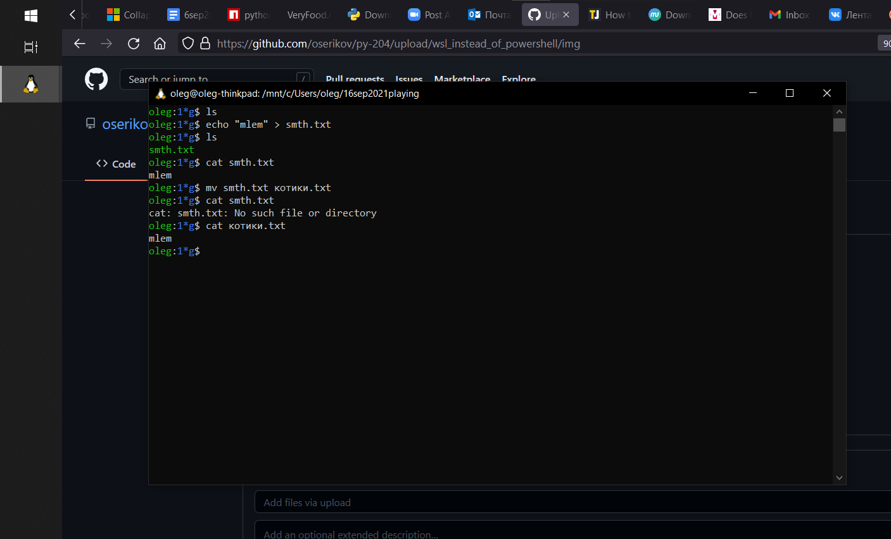

# о текстовых файлах, командной строке и установке python. **для windows и mac os**

В заметке приведены инструкции. Если они не срабатывают или вы не уверены в том, что они срабатывают, смело пишите преподам или ассистентам. Я (Олег) быстрее всего отвечаю на телеграм. Там я [@oserikov](t.me/oserikov) . 

---

* [Как открывать командную строку в папке](#Как-открывать-командную-строку-в-папке)
* [Как создать plaintext файл в папке командной строкой](#Как-создать-plaintext-файл-в-папке-командной-строкой)
* [Как посмотреть список файлов, которые уже есть в текущей папке, командной строкой](#Как-посмотреть-список-файлов-которые-уже-есть-в-текущей-папке-командной-строкой)
* [Как переименовать файл в папке командной строкой](#Как-переименовать-файл-в-папке-командной-строкой)
* [Как открывать текстовые файлы простейшим текстовым редактором](#Как-открывать-текстовые-файлы-простейшим-текстовым-редактором)
* [Как создавать текстовые файлы простейшим текстовым редактором](#Как-создавать-текстовые-файлы-простейшим-текстовым-редактором)
* [Как установить python3](#Как-установить-python3)
* [Как проверить, что python установился](#Как-проверить-что-python-установился)

---

## Как открывать командную строку в папке 

### В mac os:
нужно будет предварительно кое-что включить в настройках

* включить (если ещё не включен) New Terminal at Folder в настройках System Preferences > Keyboard > Shortcuts > Services 
* открыть папку в проводнике
* правая кнопка мыши > New Terminal at Folder

### В windows 10:
Поставьте курсор в адресную строку "Проводника", открытого в нужной папке. (кликните мышью в адресной строке справа от отображенного адреса). Появится возможность редактировать текст, написанный в адресной строке. Сотрите всё, что написано в адресной строке. Напишите вместо всего этого `wsl` и нажмите на Enter. Откроется окно командной строки WSL, это -- то, что нужно.

Ниже картинки.

#### 1  

#### 2  

#### 3  

#### 4  

## Как создать plaintext файл в папке командной строкой

Выполните в командной строке в нужной папке команду `echo "" > имяжеланногофайла.расширениежеланногофайла`

Например, `echo "" > my_f.txt`

(Попробуйте повыполнять команду с непустым текстом между кавычками, например с `"fikl"` вместо `""`, попробуйте разные расширения или вообще без них).

## Как переименовать файл в папке командной строкой

Выполните в командной строке в нужной папке команду `mv староеимяфайла желанноеимяфайла`. 
Помните, что если у файла есть расширение, то оно входит в имяфайла:

имя файла `котики.txt` -- это `котики.txt` , а не `котики`.

Например:  

## Как посмотреть список файлов, которые уже есть в текущей папке, командной строкой

Откройте командную строку в нужной папке. Выполните команду `ls`.

## Как открывать текстовые файлы простейшим текстовым редактором
кликнув по иконке выбрать файл, затем, кликнув по нему *правой* кнопкой мыши, выбрать Открыть с помощью (Open With)...  
В windows: **Блокнот**  
В Mac: **TextEdit**. Важно! TextEdit нужно перевести в правильный режим, чтобы было удобнее редактировать код. См. инструкцию ниже.

### Использование TextEdit для редактирования plaintext файлов
Настройте textedit так, что новые текстовые файлы будут создаваться в plaintext стиле. 
Для этого следуйте инструкции из главы **Using the Plain Text Mode for New TextEdit Documents** [здесь](https://www.techjunkie.com/use-plain-text-mode-textedit/).

## Как создавать текстовые (plain-text) файлы простейшим текстовым редактором

Упражнение: создайте (по инструкции ниже) текстовый файл в папке "Рабочий стол" ("Desktop"), а затем посмотрите через командную строку его имя.

#### В windows:
программой Блокнот (Notepad). 
можно всякое понаписать в открывшемся окне программы
потом Файл -> Сохранить как
и выбрать куда и с каким именем сохранить файл.

#### В mac os:
программой TextEdit в plain-text режиме: [ссылка на видеопример с ютуба](https://www.youtube.com/watch?v=OLBhDnPbfkQ).

## Как установить python3

### На mac os:
как в [видео](https://youtu.be/TgA4ObrowRg) (там в конце удаляют python3, это лишнее, это не нужно)

### На windows:
* запустите командную строку wsl
* выполните команду  `sudo apt update`
* выполните команду `sudo apt install python3 python3-pip python3-dev`

## Как проверить, что python установился
* запустить командную строку
* написать `python --version` или `py --version` или `py3 --version` или `python3 --version` . Что-то из этого должно сработать.  
Если в ответ напечаталось что-то типа Python 3.что-то это хорошо.  
**Запомните**, какая команда сработала у вас на компе, или запишите это где-то.

Если напечатается какое-то сообщение об ошибке или том, что компьютер не понял слово python — пишите в чат курса, преподам или ассистентам -- разберёмся!
